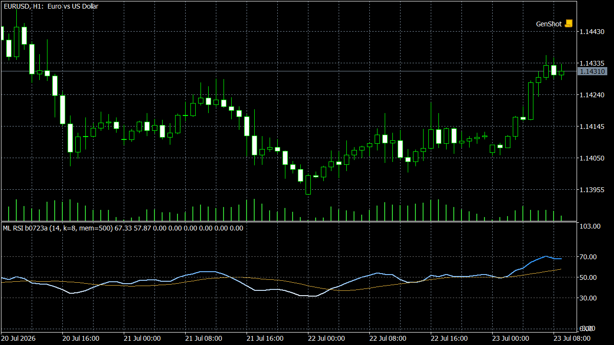

# RSI Analógico Lorentziano

Porte para C++ (DLL) e MQL5 de um indicador híbrido de osciladores e machine learning para o MetaTrader 5.

## O que é

Este é um porte do indicador Pine "Machine Learning RSI | AI Classification & Ranking", publicado na TradingView por Zeiierman, reimplementado do zero em C++ e MQL5 (sem reaproveitamento do código Pine — apenas a lógica foi replicada).

O motor parte do RSI clássico, mas em vez de interpretar o valor bruto contra níveis fixos de sobrecompra/sobrevenda, transforma cada barra confirmada em um vetor de 8 features derivadas do RSI:

- valor do RSI
- slope (inclinação)
- aceleração
- distância do nível 50
- percentil dentro da janela
- volatilidade do RSI
- spread entre RSI rápido e lento
- regime suavizado

Cada barra confirmada tem seu vetor de features armazenado junto com um rótulo de outcome futuro — o movimento de preço nos períodos seguintes, normalizado pelo ATR — formando um banco de memória histórica em janela deslizante.

Para a barra atual, o motor busca nesse banco os k vizinhos mais próximos por distância de Lorentzian log-comprimida (`log(1 + |diferença|)`, em vez de distância euclidiana), o que reduz o peso de outliers extremos na comparação. Os vizinhos votam ponderados pela proximidade, e o resultado agregado gera:

- bias direcional (bullish/bearish)
- analogScore (força da classificação)
- rank (qualidade do setup: alinhamento de tendência, volatilidade, regime, consistência)
- confidence (convicção do modelo: concordância entre analogs, clustering, persistência)

Os pesos de cada uma das 8 features são recalculados continuamente por uma otimização baseada em Fisher Discriminant Analysis, que identifica quais características separam melhor os outcomes historicamente bullish dos bearish e realoca peso para elas.

Sinais de long/short só disparam quando rank e confidence superam thresholds configuráveis simultaneamente — o motor não gera sinal apenas por um cruzamento de nível isolado. Um Supertrend adaptativo complementa o sistema como filtro de tendência e trailing stop: a largura da banda se ajusta dinamicamente conforme a convicção do modelo, ficando mais estreita em alta convicção e mais larga em condições de baixa convicção ou lateralização.

O cálculo roda na DLL C++ como motor stateless: o estado persistente (banco de memória, pesos adaptativos) vive nos buffers `INDICATOR_CALCULATIONS` do MQL5, preservados pelo terminal entre ticks. O arquivo `.mq5` é o wrapper que chama a DLL e desenha os buffers no gráfico.

## Instalação — versão pré-compilada

1. Copie `ml_rsi.dll` para a pasta `MQL5/Libraries` do terminal MetaTrader 5.
2. Copie `TV_02_MLRSI.ex5` para a pasta `MQL5/Indicators` do mesmo terminal.
3. Reinicie o MetaTrader 5 (ou, no Navegador, clique com o botão direito em "Indicadores" e escolha "Atualizar").
4. Arraste o indicador `TV_02_MLRSI` do Navegador para o gráfico desejado.

## Build a partir do código-fonte

1. Compile o motor C++ (`ml_rsi`) com g++/MinGW-w64 usando o `build.sh` incluso em `src/cpp/` — o script gera o `.dll` x64.
2. Abra `src/mql5/TV_02_MLRSI.mq5` no MetaEditor do MetaTrader 5.
3. Compile com F7 para gerar o `TV_02_MLRSI.ex5`.

## Licença

Este repositório é licenciado sob CC-BY-NC-SA-4.0; a lógica original em Pine Script é de autoria de Zeiierman.

## Aviso

Uso educacional e de análise técnica. Não é recomendação de investimento.
